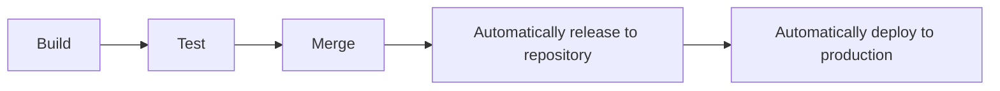

Vulnerability -
A weakness that can be exploited by a threat.

Exploit -
A way of taking advantage of a vulnerability.

Vulnerability management- 
The process of findng and patching vulnerabilities.
This is a 4 step proces:
1. Identify vulnerabilities.
2. Consider potential exploits.
3. Prepare defenses against threats.
4. Evaluate those defenses.

Zero-day- 
An exploit that was previously unknown.

# What is CI/CD and why does it matter?
CI/CD automates the entire software release process, from code creation to deployment. This automation is what enables modern development teams to be agile and respond qucikly to user needs. 

1. ### Continuous Integratio(CI): Building a Solid Foundation
CI is all about frequently merging code from different developers into a central location.
This triggers automated processes like building the software and running tests.
CI catches problems through an automated proces: every time code is integrated, the system automatically builds and tests it.
This immediate feedback loop reveals integration problems as soon as they occur.
CI helps catch integration problems early, leading to higher quality code.
**Think of it as a foundation of the pipeline.**

2. ### Continuous Delivery(CD): Ready to Release
CD means your code is always ready to be released to users. After passing automated tests, code is automatically deployed to a staging environment(a practice environment) or prepared for final release.
Typically, a manual approval step is still needed before going live to production, which provides a control point.

3. ### Continuous Deployment(CD): Fully Automated Releases
CD automates the entire release process. Changes that pass all automated checks are automatically deployes directly to the live production environment, with no manual approval. This is all about speed and efficiency.

