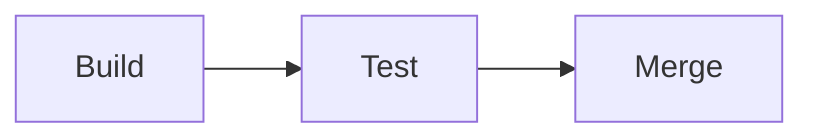

Vulnerability -
A weakness that can be exploited by a threat.

Exploit -
A way of taking advantage of a vulnerability.

Vulnerability management- 
The process of findng and patching vulnerabilities.
This is a 4 step proces:
1. Identify vulnerabilities.
2. Consider potential exploits.
3. Prepare defenses against threats.
4. Evaluate those defenses.

Zero-day- 
An exploit that was previously unknown.

