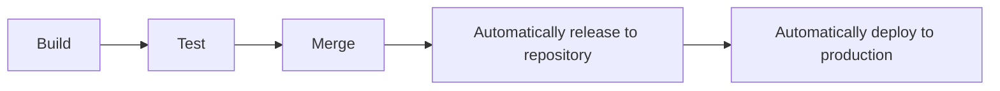

Vulnerability -
A weakness that can be exploited by a threat.

Exploit -
A way of taking advantage of a vulnerability.

Vulnerability management- 
The process of findng and patching vulnerabilities.
This is a 4 step proces:
1. Identify vulnerabilities.
2. Consider potential exploits.
3. Prepare defenses against threats.
4. Evaluate those defenses.

Zero-day- 
An exploit that was previously unknown.

# What is CI/CD and why does it matter?
CI/CD automates the entire software release process, from code creation to deployment. This automation is what enables modern development teams to be agile and respond qucikly to user needs. 

1. ### Continuous Integratio(CI): Building a Solid Foundation
CI is all about frequently merging code from different developers into a central location.
This triggers automated processes like building the software and running tests.
CI catches problems through an automated proces: every time code is integrated, the system automatically builds and tests it.
This immediate feedback loop reveals integration problems as soon as they occur.
CI helps catch integration problems early, leading to higher quality code.
**Think of it as a foundation of the pipeline.**

2. ### Continuous Delivery(CD): Ready to Release
CD means your code is always ready to be released to users. After passing automated tests, code is automatically deployed to a staging environment(a practice environment) or prepared for final release.
Typically, a manual approval step is still needed before going live to production, which provides a control point.

3. ### Continuous Deployment(CD): Fully Automated Releases
CD automates the entire release process. Changes that pass all automated checks are automatically deployes directly to the live production environment, with no manual approval. This is all about speed and efficiency.

# Security Benefits of Continuous Delivery and Deployment
1. Dynamic Application Security Testing(DAST):
Automated tests that find vulnerabilities in running applications in realistic staging environments.

2. Security Compliance Checks: Automated checks that ensures software meets your organization's security rules and policies.

3. Infrastructure Security Validations: Checks that makes sure the systems hosting your software are secure.

# Why a secure CI/CD Pipelines is Non-Negotiable:
1. **Secure Automation**: CI/CD automates repetitive tasks: building,testing,deploying. When automation is implemented securely, this reduces errors from manual work,speeds processes, and importantly, reduces human errors that create vulnerabilities.

2. **Improved Code Quality via Security Checks:**
 Automated tests in CI/CD rigorously check code before release. Crucially, this includes automated security tests. This leads to fewer bugs and security weaknesses in final software, but only if security tests integrate effectively within the pipeline.

3. **Faster time to market for security updates:**
CI/CD accelerates releases. This enables faster delivery of new features, bug fixes and security updates,improving response time to both user needs and security threats.
This rapid deployment of security updates is a significant security advantage of a well-secured CI/CD pipeline.

4. **Enhanced collaboration and feedback with safety focus:**
CI/CD encourages collaboration between development,security,testing and operations teams.
Quick feedback loop aid identification and resolution of vulnerabilities early in development. This collaborative environment is essential to build security into the pipeline and address vulnerabilities proactively.

5. **Reduced Risk**:
Frequent, smaller releases, a result of CI/CD, are less risky than large, infrequent releases. If issues arise (including security issues), pinpointing and fixing the problem becomes easier. This also applies to security vulnerabilities; smaller, frequent releases limit the potential impact of a security flaw introduced in any single release, provided security monitoring and testing remain continuous.

# Common CI/CD Pipeline Vulnerabilities:
1. ### Insecure Dependencies: Risk from third-party code
CI/CD pipelines often use many third-party libraries and components.
If these components have known vulnerablities, those vulnerabilities can be unknowingly added to ur application during the automated build process.

*Action step:* Regularly  scan and update ur dependencies.Make sure you're using secure versions of all external components.

2. ### Misconfigured Permissions: Controlling Access
Weak access controls in CI/CD tools, code repositories, and related systems are a significant vulnerability. Unauthorized access can allow attackers to modify code, pipeline configurations, or inject malicious content.

*Action step:*  Implement strong access management using Role-Based Access Control (RBAC). Ensure only authorized individuals can access and change critical pipeline elements.

3. ### Lack of Automated Security Testing: Missing Critical Checks
Failing to include automated security testing in your CI/CD pipeline is a serious error. Without tools like SAST and DAST, you are almost guaranteed to release software full of vulnerabilities that will go undetected until after it's live, leading to significantly higher costs and effort to fix.

*Action step:* Integrate automated security testing (SAST and DAST) into your CI/CD pipeline. This should be a core part of your secure CI/CD strategy.

4. ### Exposed Secrets: Protecting Sensitive Information
Hardcoding sensitive data like API keys, passwords, and tokens directly into code or pipeline settings is a serious security mistake. If exposed, these secrets can lead to major security breaches.

*Action step:* Never hardcode secrets. Use secure vaults or dedicated secrets management tools to store and manage sensitive information. Enforce this practice across your team.

5. ### Unsecured Build Environments: Protecting the Pipeline Infrastructure
The CI/CD environment itself (the servers and systems that run your pipeline) needs to be secure. If this environment is vulnerable, attackers can compromise it to alter builds, inject malicious code, or steal sensitive data.

*Action step:*  Harden your build environments. Use secure containers or virtual machines to minimize the risk of a compromised pipeline.

# Building a Secure CI/CD Pipeline: Defense in Depth

1. **Integrate Security from the Start:**
 Embrace DevSecOps: Adopt a DevSecOps mindset. This means building security into every stage of development, from planning to deployment and beyond. This naturally includes embedding security checks into your CI/CD pipeline.

2. **Implement Strong Access Controls:** 
Use strict permission policies based on the principle of least privilege. Only grant necessary access to code, pipeline settings, and deployment configurations. Use tools like Multi-Factor Authentication (MFA) and Role-Based Access Control (RBAC) to secure your CI/CD environment.

3. **Automate Security Testing Everywhere:**
 Make automated security scans and tests a fundamental part of your build and deployment process. Tools like SAST, Software Composition Analysis (SCA), and DAST are not optional extras – they are essential for a secure CI/CD pipeline so you can catch vulnerabilities early.

4. **Keep Dependencies Updated:**
 Maintain a current inventory of all third-party dependencies, libraries, and CI/CD plugins. Regularly update these components to patch security vulnerabilities (CVEs). Tools like 
Dependabot and Snyk can automate dependency management.

5. **Secure Secrets Management:** 
Never hardcode sensitive information in your code or pipeline configurations. Require the use of dedicated secrets management tools like HashiCorp Vault or AWS Secrets Manager. Securely store, access, and rotate secrets throughout the CI/CD process.

#### Defense in depth:
A layered approach to vulnerability management that reduces risk.
Layers:
1. Perimeter layer.
2. Network layer.
3. Endpoint layer.
4. Application layer.
5. Data layer.

#### Exposure-
A mistake that can be exploited by a threat.

#### Common Vulnerabilities and Exposures list(CVE list)
An openly accessible dictionary of known vulnerabilities and exposures.
It was created by MITRE-A collection of non-profit research and development centers.
**Criteria**
1. Independent of other issues.
2. It must be recognized as a potential risk.
3. Submitted with supporting evidence.
4. Only support one codebase.

#### CVE Numbering Authority(CNA)-
An organization that volunteers to analyze and distribute information on eligible CVEs.

#### Common Vulnerability Scoring System(CVSS)-
A measurement system that scores the severity of a vulnerabliity.

# OWASP (Open Worldwide Application Security Project)-
It is a non-profit foundation that works to improve the security of a software. OWASP is an open platform that security professionals from around the world use to share information,tools and events that are focused on securing the web.

These are the most regularly listed vulnerabilities that appear in their rankings to know about:
1. **Broken access control**
Access controls limit what users can do in a web application. For example, a blog might allow visitors to post comments on a recent article but restricts them from deleting the article entirely. 
Failures in these mechanisms can lead to unauthorized information disclosure, modification, or destruction. They can also give someone unauthorized access to other business applications.

2. **Cryptographic failures**
Information is one of the most important assets businesses need to protect. Privacy laws such as General Data Protection Regulation (GDPR) require sensitive data to be protected by effective encryption methods. 
Vulnerabilities can occur when businesses fail to encrypt things like personally identifiable information (PII). For example, if a web application uses a weak hashing algorithm, like MD5, it’s more at risk of suffering a data breach.
 
3. **Injection**
Injection occurs when malicious code is inserted into a vulnerable application. Although the app appears to work normally, it does things that it wasn’t intended to do. Injection attacks can give threat actors a backdoor into an organization’s information system. 
A common target is a website’s login form. When these forms are vulnerable to injection, attackers can insert malicious code that gives them access to modify or steal user credentials. 

4. **Insecure design**
Applications should be designed in such a way that makes them resilient to attack. When they aren’t, they’re much more vulnerable to threats like injection attacks or malware infections.
Insecure design refers to a wide range of missing or poorly implemented security controls that should have been programmed into an application when it was being developed.

5. **Security misconfiguration**
Misconfigurations occur when security settings aren’t properly set or maintained. Companies use a variety of different interconnected systems. Mistakes often happen when those systems aren’t properly set up or audited. A common example is when businesses deploy equipment, like a network server, using default settings. This can lead businesses to use settings that fail to address the organization's security objectives.

6. **Vulnerable and outdated components**
Vulnerable and outdated components is a category that mainly relates to application development. Instead of coding everything from scratch, most developers use open-source libraries to complete their projects faster and easier.
This publicly available software is maintained by communities of programmers on a volunteer basis. Applications that use vulnerable components that have not been maintained are at greater risk of being exploited by threat actors.

7. **Identification and authentication failures**
Identification is the keyword in this vulnerability category. When applications fail to recognize who should have access and what they’re authorized to do, it can lead to serious problems. For example, a home Wi-Fi router normally uses a simple login form to keep unwanted guests off the network. If this defense fails, an attacker can invade the homeowner’s privacy.

8. **Software and data integrity failures**
Software and data integrity failures are instances when updates or patches are inadequately reviewed before implementation. Attackers might exploit these weaknesses to deliver malicious software. When that occurs, there can be serious downstream effects. Third parties are likely to become infected if a single system is compromised, an event known as a supply chain attack.
A famous example of a supply chain attack is the 
SolarWinds cyber attack (2020) where hackers injected malicious code into software updates that the company unknowingly released to their customers.

9. **Security logging and monitoring failures**
In security, it's important to be able to log and trace back events. Having a record of events like user login attempts is critical to finding and fixing problems. Sufficient monitoring and incident response is equally important.

10. **Server side request forgery**
Companies have public and private information stored on web servers. When you use a hyperlink or click a button on a website, a request is sent to a server that should validate who you are, fetch the appropriate data, and then return it to you.
Server-side request forgeries (SSRFs) are when attackers manipulate the normal operations of a server to read or update other resources on that server. These are possible when an application on the server is vulnerable. Malicious code can be carried by the vulnerable app to the host server that will fetch unauthorized data.

# OSINT (Open source intelligence):
1. Information refers to the collection of raw data or facts about a specific subject. Intelligence, on the other hand, refers to the analysis of information to produce knowledge or insights that can be used to support decision-making.

2. For example, new information might be released about an update to the operating system (OS) that's installed on your organization's workstations. Later, you might find that new cyber threats have been linked to this new update by researching multiple cybersecurity news resources. The analysis of this information can be used as intelligence to guide your organization's decision about installing the OS updates on employee workstations.

3. OSINT plays a significant role in information security (InfoSec), which is the practice of keeping data in all states away from unauthorized users.

4. For example, a company's InfoSec team is responsible for protecting their network from potential threats. They might utilize OSINT to monitor online forums and hacker communities for discussions about emerging vulnerabilities. If they come across a forum post discussing a newly discovered weakness in a popular software that the company uses, the team can quickly assess the risk, prioritize patching efforts, and implement necessary safeguards to prevent an attack.

Here are some of the ways OSINT can be used to generate intelligence:
1. To provide insights into cyber attacks.

2. To detect potential data exposures.

3. To evaluate existing defenses.

4. To identify unknown vulnerabilities.

## OSINT TOOLS:
There's an enormous amount of open-source information online. Finding relevant information that can be used to gather intelligence is a challenge. Information can be gathered from a variety of sources, such as search engines, social media, discussion boards, blogs, and more. Several tools also exist that can be used in your intelligence gathering process. Here are just a few examples of tools that you can explore:

1. VirusTotal
 is a service that allows anyone to analyze suspicious files, domains, URLs, and IP addresses for malicious content.

2. MITRE ATT&CK®
 is a knowledge base of adversary tactics and techniques based on real-world observations.

3. OSINT Framework
 is a web-based interface where you can find OSINT tools for almost any kind of source or platform.

4. Have I been Pwned
 is a tool that can be used to search for breached email accounts.