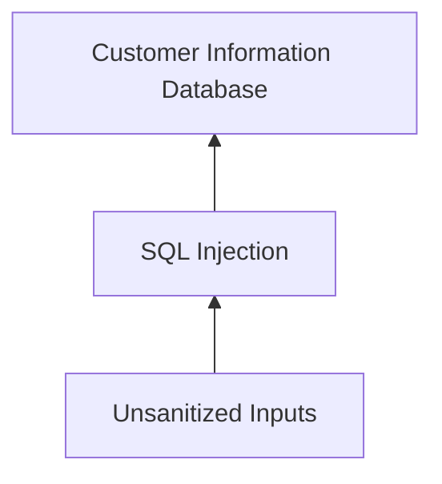

Threat modeling- The process of identifying assets,their vulnnerabilities and how each is exposed to threats.
Steps:
1. Define the scope.
2. Identify threats.
3. Characterize the environment.
4. Analyze threats.
5. Mitigate risks.
6. Evaluate findings.

# PASTA:(Process for Attack Simulation and Threat Analysis)
A popular threat modeling framework that's used across many industries.
1. Define business and security objectives
2. Define the technical scope
3. Decompose the application
4. Perform a threat analysis
5. Perform a vulnerability analysis
6. Conduct attack modeling
7.  Analyze risk and impact

# Threat modeling frameworks:
1. **STRIDE**
STRIDE is a threat-modeling framework developed by Microsoft. It’s commonly used to identify vulnerabilities in six specific attack vectors. The acronym represents each of these vectors: Spoofing, tampering, repudiation, information disclosure,denial of service and elevation of privilege.

2. **PASTA**
The Process of Attack Simulation and Threat Analysis (PASTA) is a risk-centric threat modeling process developed by two OWASP leaders and supported by a cybersecurity firm called VerSprite. Its main focus is to discover evidence of viable threats and represent this information as a model.

 PASTA's evidence-based design can be applied when threat modeling an application or the environment that supports that application. Its seven stage process consists of various activities that incorporate relevant security artifacts of the environment, like vulnerability assessment reports.

3. **Trike**
Trike is an open source methodology and tool that takes a security-centric approach to threat modeling. It's commonly used to focus on security permissions, application use cases, privilege models, and other elements that support a secure environment.

4. **VAST** 
The Visual, Agile, and Simple Threat (VAST) Modeling framework is part of an automated threat-modeling platform called ThreatModeler®. Many security teams opt to use VAST as a way of automating and streamlining their threat modeling assessments.

# Note: 
One of the keys to threat modeling is asking the right questions:

What are we working on?

What kinds of things can go wrong?

What are we doing about it?

Have we addressed everything?

Did we do a good job?
